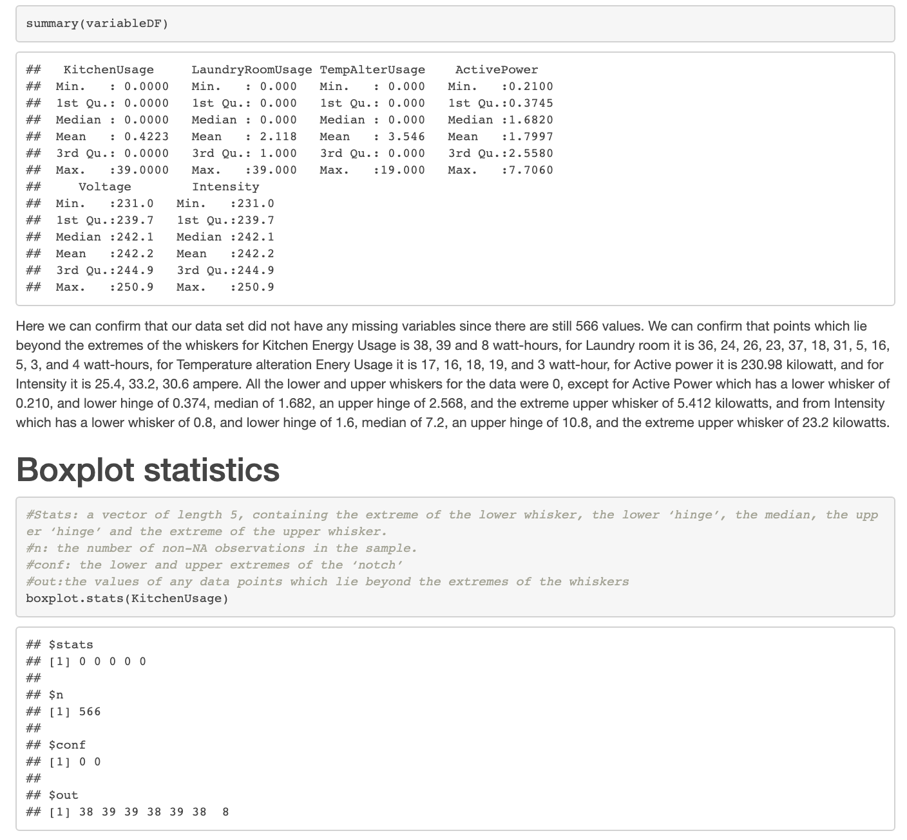
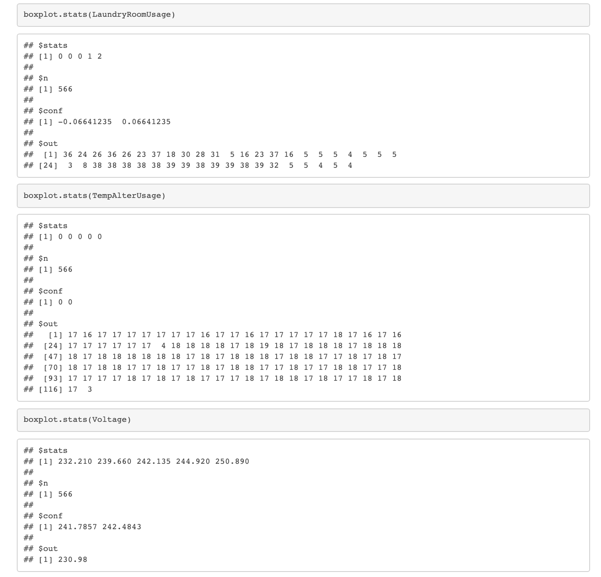
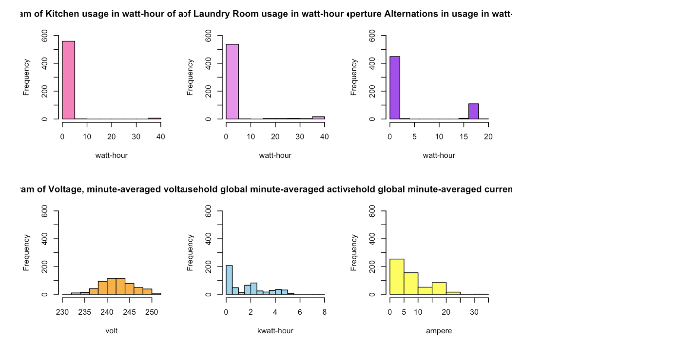

# Energy-Consumption-Analysis

House Hold Energy Power Consumption analysis of a french home.

*Powerpoint* containing further analysis avaible above within main folder. Below is the **full report** in detail.

